# SIEM Setup and Detection Lab

## Objective
Deploy a functional Security Information and Event Management (SIEM) environment using Splunk Enterprise on Windows Server 2022, integrate native Windows logs and Sysmon telemetry, and develop baseline detection searches for authentication failures, PowerShell activity, and network connections.

## Topology or Environment
- Host: Windows Server 2022 VM (SPLUNK-VM)
- Tools: Splunk Enterprise 9.x, Sysmon v15.15
- Data Sources: Windows Security, System, Application Event Logs; Sysmon Operational Log
- Network: Bridged adapter; Splunk Web accessible from host via `http://<VM-IP>:8000`

---

## Step 1 – Install Splunk Enterprise
- Installed Splunk Enterprise on Windows Server 2022 VM.
- Verified Splunk Web accessibility at `http://localhost:8000`.
- Enabled automatic service start on boot.

**Artifacts**
- 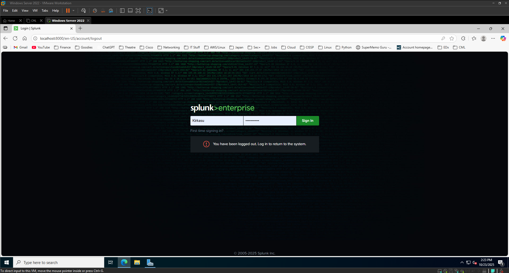
- 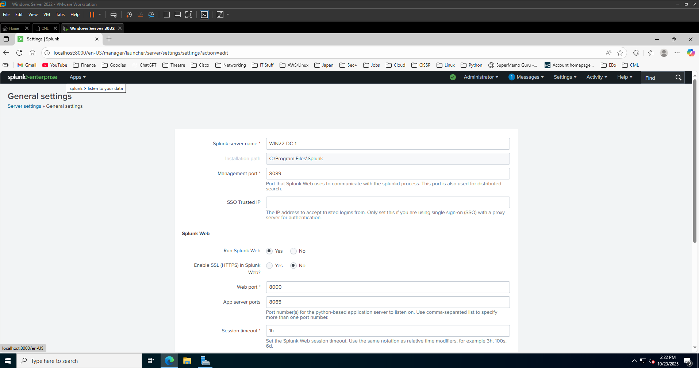

---

## Step 2 – Enable Windows Event Log Ingestion
- Configured inputs for Security, System, and Application logs via `inputs.conf`.
- Verified ingestion with:
```
index=main sourcetype=WinEventLog:* earliest=-15m
```
- Configuration file: [config/inputs.conf](./config/inputs.conf)

**Artifacts**
- 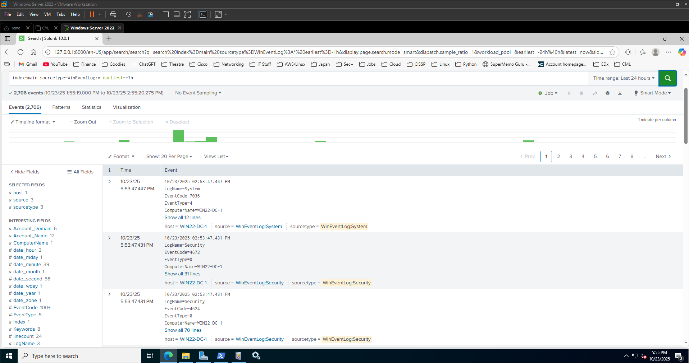
- 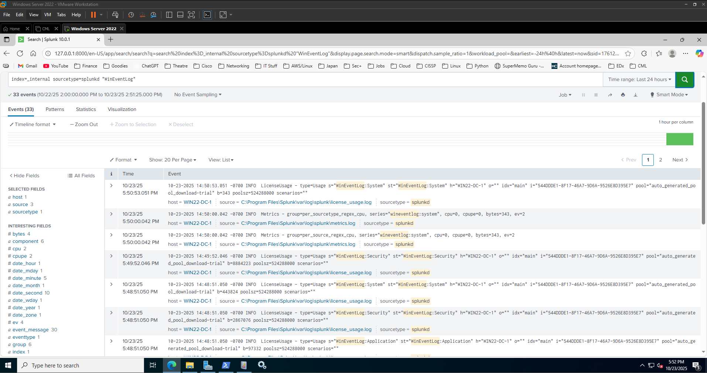

---

## Step 3 – Install and Integrate Sysmon
- Installed Sysmon using a baseline configuration (SwiftOnSecurity).
- Registered the Sysmon event manifest to create `Microsoft-Windows-Sysmon/Operational`.
- Verified Event IDs 1 (Process Create) and 3 (Network Connect) in Event Viewer and Splunk.
- Configuration file: [config/sysmonconfig.xml](./config/sysmonconfig.xml)

**Artifacts**
- 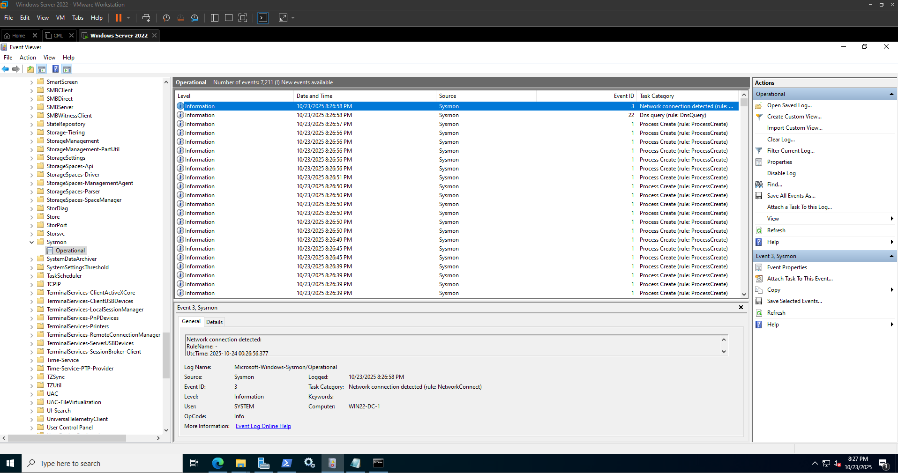
- 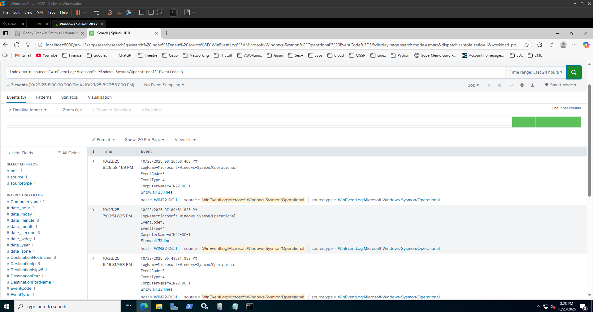

---

## Step 4 – Detection Searches and Reporting

Created baseline detection searches in Splunk to identify key security activities.

### 4.1 Failed Logon Analysis (Event ID 4625 / 4624)
Detects failed authentication attempts by account and source.  
Also correlates repeated failures followed by a success to highlight possible brute-force attempts.

**Queries**
- [queries/failed_logons_by_account.splunkql.txt](./queries/failed_logons_by_account.splunkql.txt)
- [queries/failed_then_success_correlation.splunkql.txt](./queries/failed_then_success_correlation.splunkql.txt)

**Screenshots**
- 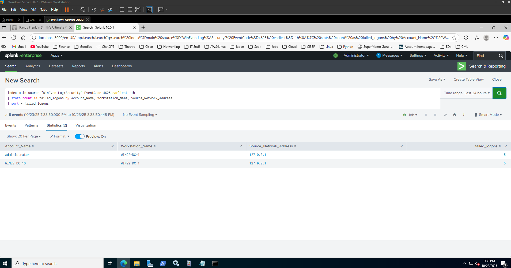
- 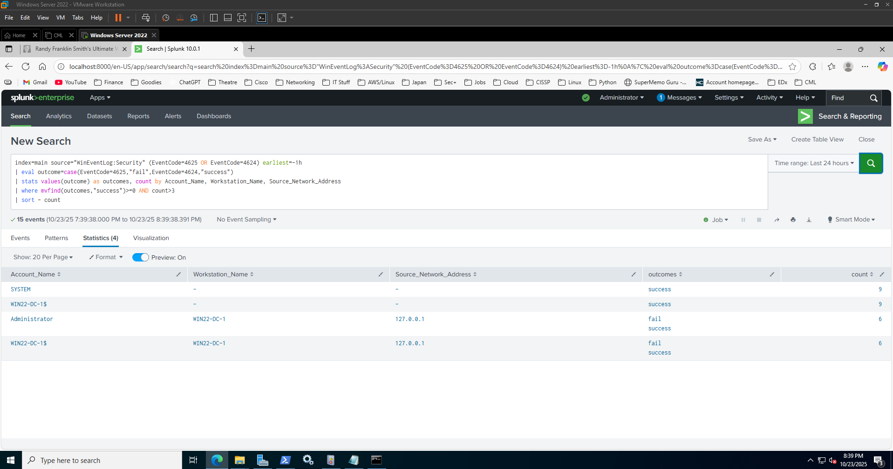

---

### 4.2 Suspicious PowerShell Execution (Sysmon Event ID 1)
Identifies PowerShell processes and flags encoded commands.

**Query**
```
index=main source="WinEventLog:Microsoft-Windows-Sysmon/Operational" EventCode=1
| search Image="*powershell.exe*"
| eval Encoded=if(match(CommandLine,"-enc"),"Yes","No")
| table _time Computer User Image CommandLine Encoded
| sort - _time
```

**Artifacts**
- [queries/powershell_suspicious_activity.splunkql.txt](./queries/powershell_suspicious_activity.splunkql.txt)  
- 

---

### 4.3 Sysmon Network Connections (Event ID 3)
Displays outbound network activity by process and destination IP.  
Useful for detecting unexpected external communication.

**Query**
```
index=main source="WinEventLog:Microsoft-Windows-Sysmon/Operational" EventCode=3 earliest=-1h
| stats count by Image, DestinationIp, DestinationPort, Protocol, User
| sort - count
```

**Artifacts**
- [queries/sysmon_networkconnections.splunkql.txt](./queries/sysmon_networkconnections.splunkql.txt)
- 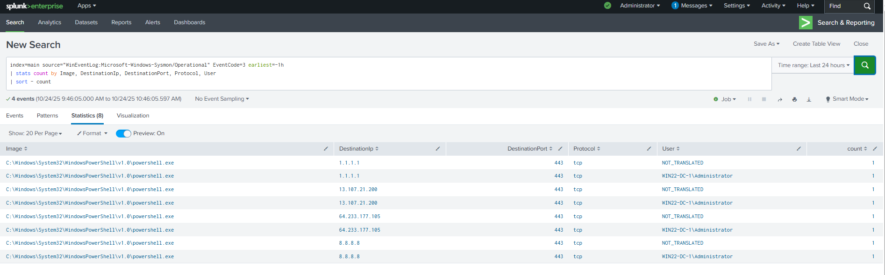

---

## Step 5 – SOC Dashboard

Built a Splunk Classic dashboard titled **“SOC Monitoring Dashboard”** to visualize detections in near real time.

**Panels**
1. **Failed Logons by Account (24 Hours)** – Bar chart of Security Event ID 4625 counts by account.  
2. **PowerShell Executions (Encoded vs Plain)** – Pie chart summarizing encoded vs plain PowerShell activity.  
3. **Outbound Network Connections** – Table of Sysmon Event ID 3 connections by process and IP.

**Dashboard Configuration**
- Saved under Splunk App: `search`
- Auto-refresh: every 300 seconds  
- Exported XML: [config/soc_monitoring_dashboard.xml](./config/soc_monitoring_dashboard.xml)

**Screenshots**
- 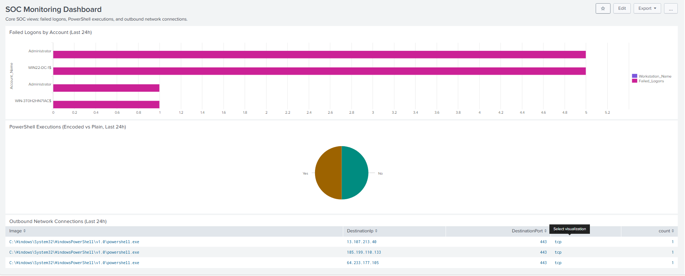
- 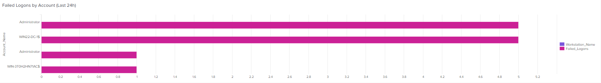
- 
- 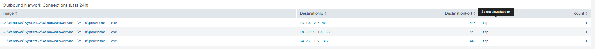

---

**Result:**  
The Splunk dashboard now provides continuous visibility into failed logons, PowerShell activity, and network connections—forming the core of a basic SOC monitoring view.
