# SIEM Setup and Detection Lab

## Objective
Deploy a functional Security Information and Event Management (SIEM) environment using Splunk Enterprise on Windows Server 2022, integrate native Windows logs and Sysmon telemetry, and develop baseline detection searches for authentication failures, PowerShell activity, and network connections.

## Topology or Environment
- Host: Windows Server 2022 VM (SPLUNK-VM)
- Tools: Splunk Enterprise 9.x, Sysmon v15.15
- Data Sources: Windows Security, System, Application Event Logs; Sysmon Operational Log
- Network: Bridged adapter; Splunk Web accessible from host via `http://<VM-IP>:8000`

---

## Step 1 – Install Splunk Enterprise
- Installed Splunk Enterprise on Windows Server 2022 VM.
- Verified Splunk Web accessibility at `http://localhost:8000`.
- Enabled automatic service start on boot.

**Artifacts**
- 
- 

**Result:**
Splunk Enterprise successfully installed, running as a service, and accessible via web interface.
---

## Step 2 – Enable Windows Event Log Ingestion
- Configured inputs for Security, System, and Application logs via `inputs.conf`.
- Verified ingestion with:
```
index=main sourcetype=WinEventLog:* earliest=-15m
```
- Configuration file: [config/inputs.conf](./config/inputs.conf)

**Artifacts**
- 
- 

**Result:**
Windows Security, System, and Application logs are being indexed into Splunk and verified via search.
---

## Step 3 – Install and Integrate Sysmon
- Installed Sysmon using a baseline configuration (SwiftOnSecurity).
- Registered the Sysmon event manifest to create `Microsoft-Windows-Sysmon/Operational`.
- Verified Event IDs 1 (Process Create) and 3 (Network Connect) in Event Viewer and Splunk.
- Configuration file: [config/sysmonconfig.xml](./config/sysmonconfig.xml)

**Artifacts**
- 
- 

**Result:**
Sysmon telemetry (Event IDs 1 and 3) is successfully flowing into Splunk, confirming endpoint process and network visibility.
---

## Step 4 – Detection Searches and Reporting

Created baseline detection searches in Splunk to identify key security activities.

### 4.1 Failed Logon Analysis (Event ID 4625 / 4624)
Detects failed authentication attempts by account and source.  
Also correlates repeated failures followed by a success to highlight possible brute-force attempts.

**Queries**
- [queries/failed_logons_by_account.splunkql.txt](./queries/failed_logons_by_account.splunkql.txt)
- [queries/failed_then_success_correlation.splunkql.txt](./queries/failed_then_success_correlation.splunkql.txt)

**Screenshots**
- 
- 

---

### 4.2 Suspicious PowerShell Execution (Sysmon Event ID 1)
Identifies PowerShell processes and flags encoded commands.

**Query**
```
index=main source="WinEventLog:Microsoft-Windows-Sysmon/Operational" EventCode=1
| search Image="*powershell.exe*"
| eval Encoded=if(match(CommandLine,"-enc"),"Yes","No")
| table _time Computer User Image CommandLine Encoded
| sort - _time
```

**Artifacts**
- [queries/powershell_suspicious_activity.splunkql.txt](./queries/powershell_suspicious_activity.splunkql.txt)  
- 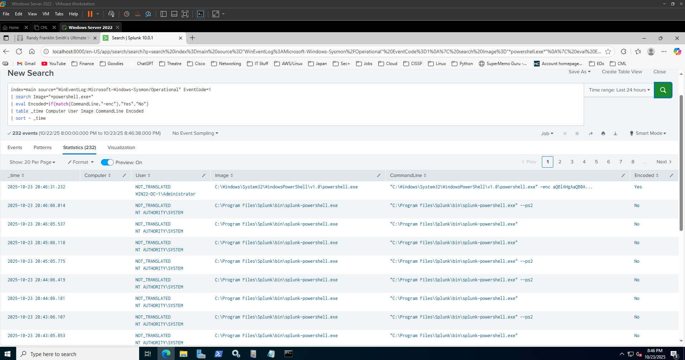

---

### 4.3 Sysmon Network Connections (Event ID 3)
Displays outbound network activity by process and destination IP.  
Useful for detecting unexpected external communication.

**Query**
```
index=main source="WinEventLog:Microsoft-Windows-Sysmon/Operational" EventCode=3 earliest=-1h
| stats count by Image, DestinationIp, DestinationPort, Protocol, User
| sort - count
```

**Artifacts**
- [queries/sysmon_networkconnections.splunkql.txt](./queries/sysmon_networkconnections.splunkql.txt)
- 

**Result:**
Core detection queries for failed logons, encoded PowerShell, and Sysmon network events executed successfully and returned expected results.
---

## Step 5 – SOC Dashboard

Built a Splunk Classic dashboard titled **“SOC Monitoring Dashboard”** to visualize detections in near real time.

**Panels**
1. **Failed Logons by Account (24 Hours)** – Bar chart of Security Event ID 4625 counts by account.  
2. **PowerShell Executions (Encoded vs Plain)** – Pie chart summarizing encoded vs plain PowerShell activity.  
3. **Outbound Network Connections** – Table of Sysmon Event ID 3 connections by process and IP.

**Dashboard Configuration**
- Saved under Splunk App: `search`
- Auto-refresh: every 300 seconds  
- Exported XML: [config/soc_monitoring_dashboard.xml](./config/soc_monitoring_dashboard.xml)

**Screenshots**
- 
- 
- 
- 

**Result:**
Custom Splunk dashboard visualizes detections in real time, confirming end-to-end data ingestion and analytic visibility.
---

## Step 6 – Windows Server & Splunk Hardening

Hardened the SIEM host and Splunk installation to reduce attack surface, enforce secure access, and enable auditing visibility.

### 6.1 Windows Server Hardening
- Disabled Guest account and renamed default Administrator.  
  ```powershell
  net user Guest /active:no
  wmic useraccount where "name='Administrator'" rename "SecAdmin"
  ```
- Enforced password & lockout policy.  
  ```powershell
  net accounts /minpwlen:12 /maxpwage:45 /lockoutthreshold:3 /lockoutduration:15
  ```
- Enabled Windows Firewall and created inbound rule for Splunk Web (port 8000).  
  ```powershell
  Set-NetFirewallProfile -Profile Domain,Public,Private -Enabled True
  New-NetFirewallRule -DisplayName "Allow Splunk Web" -Direction Inbound -Protocol TCP -LocalPort 8000 -Action Allow
  ```
- Enabled auditing for logon and network connection activity.  
  ```powershell
  AuditPol /set /category:"Logon/Logoff" /success:enable /failure:enable
  AuditPol /set /category:"Account Logon" /success:enable /failure:enable
  ```
- Disabled legacy SMBv1 protocol.  
  ```powershell
  Disable-WindowsOptionalFeature -Online -FeatureName "SMB1Protocol" -NoRestart
  ```
- Configuration script: [config/hardening_baseline.ps1](./config/hardening_baseline.ps1)

**Screenshots**
- 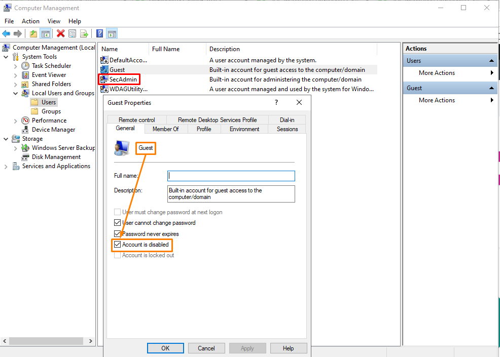
- 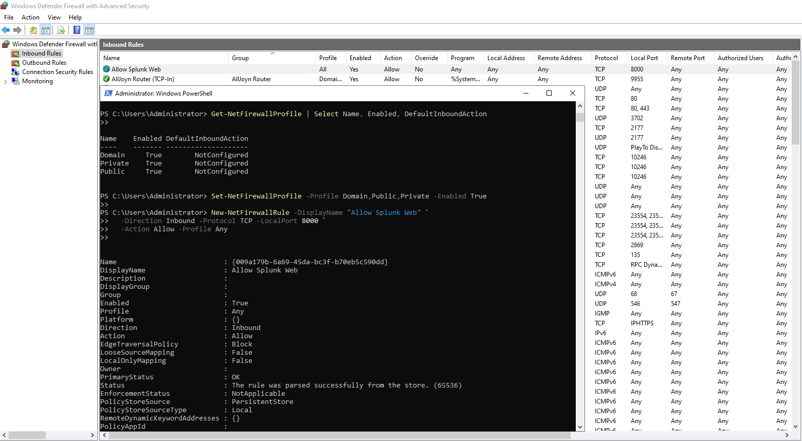
- 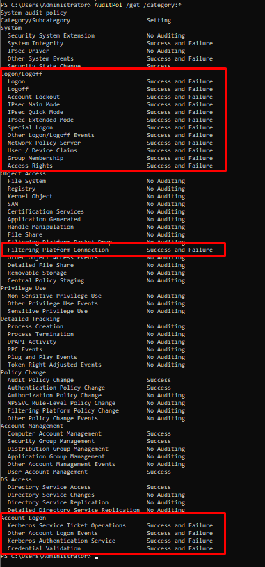

---

### 6.2 Splunk Hardening
- Enabled HTTPS and changed Splunk Web to port 8443.  
  - Config file: [config/web.conf](./config/web.conf)
  ```ini
  [settings]
  httpport = 8443
  enableSplunkWebSSL = true
  ```
- Created least-privilege roles: `analyst` (search-only) and `admin` (full).  
  - Config file: [config/authorize.conf](./config/authorize.conf)
- Restarted Splunk service to apply settings.  
  ```powershell
  net stop splunkd
  net start splunkd
  ```

**Screenshots**
- 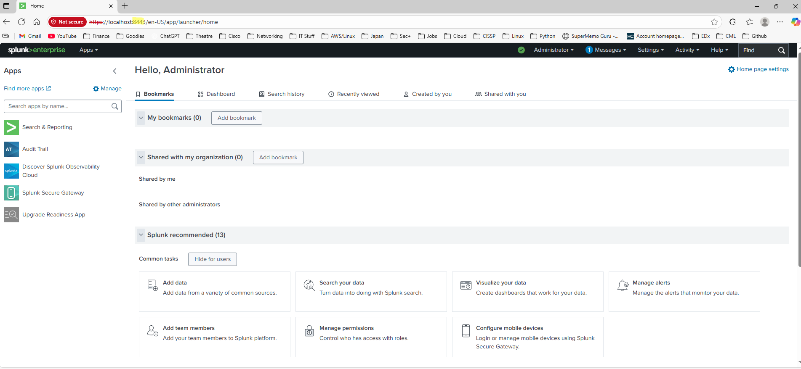
- 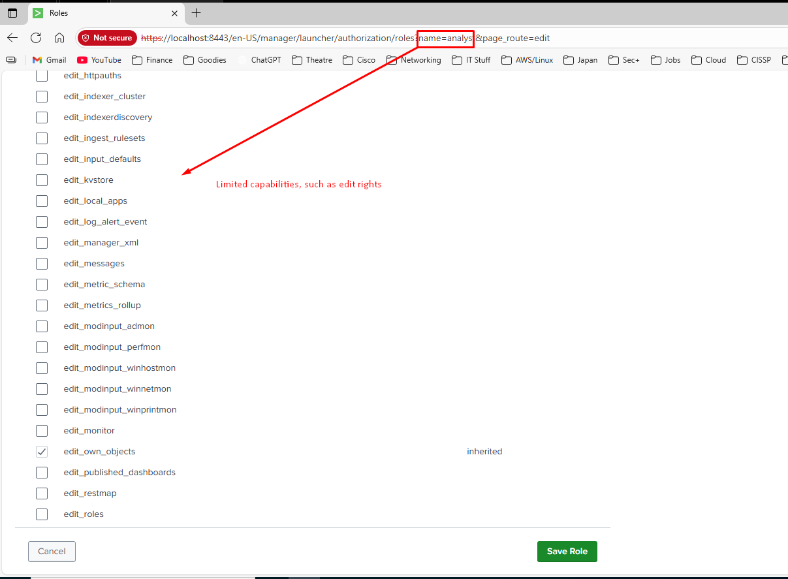
- 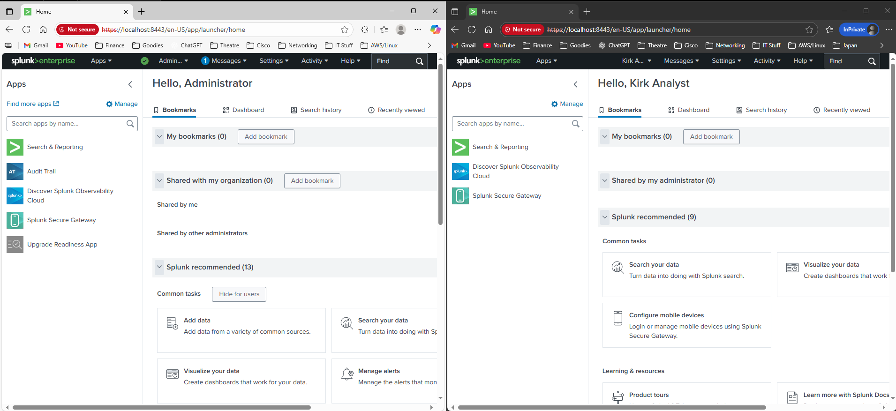

**Result:**
Server baseline hardened with firewall, password policy, and auditing; Splunk instance secured with HTTPS and least-privilege roles.
---

## Step 7 – Alerting and Correlation Rules

Converted detections into scheduled alerts (every 5 minutes, 10–15 minute window).

### 7.1 Failed Logon Brute-Force → Success
SPL:
```
index=main source="WinEventLog:Security" (EventCode=4625 OR EventCode=4624) earliest=-10m
| eval outcome=if(EventCode=4625,"fail","success")
| stats values(outcome) as outcomes, count(eval(EventCode=4625)) as failures by Account_Name, Source_Network_Address, Workstation_Name
| where failures>=5 AND mvfind(outcomes,"success")>=0
| sort - failures
```
**Screenshots**
- 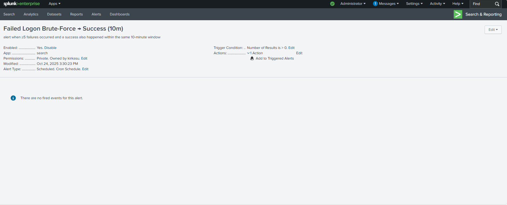
- 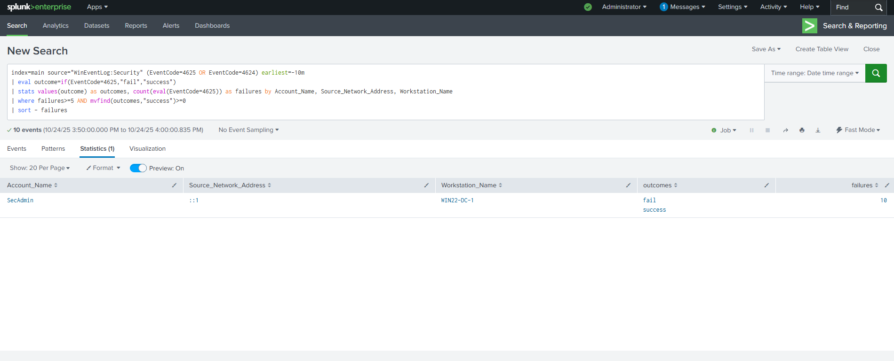

---

### 7.2 Encoded PowerShell Detected
SPL:
```
index=main source="WinEventLog:Microsoft-Windows-Sysmon/Operational" EventCode=1 earliest=-10m
| search Image="*\\powershell.exe"
| where match(CommandLine,"(?i)\\s-enc(odedCommand)?\\b")
| table _time Computer User Image CommandLine
| sort - _time
```
**Screenshots**
- 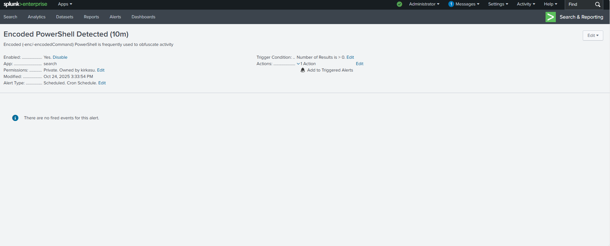
- 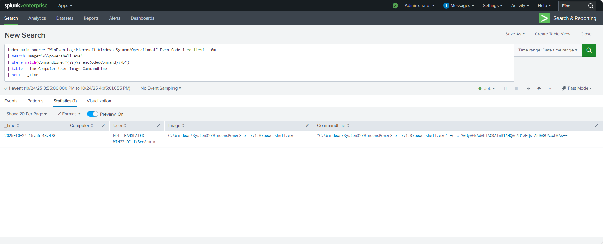

---

### 7.3 Outbound Connection Spike (Sysmon 3)
SPL:
```
index=main source="WinEventLog:Microsoft-Windows-Sysmon/Operational" EventCode=3 earliest=-15m
| stats count as connections by Image, DestinationIp
| where connections>=2
| sort - connections
```
**Screenshots**
- 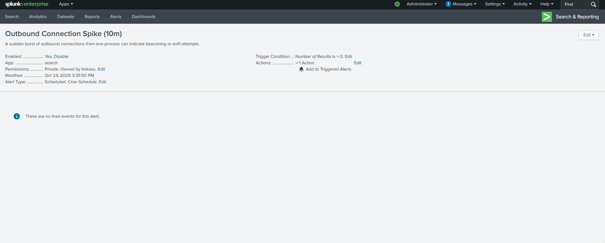
- 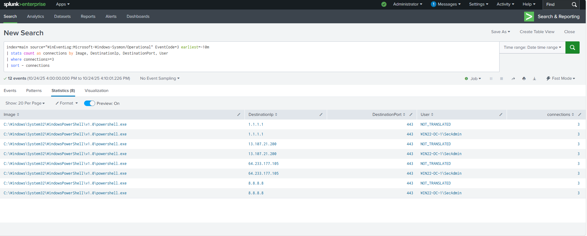

---

### 7.4 Summary
- All alerts confirmed firing in Triggered Alerts:  
  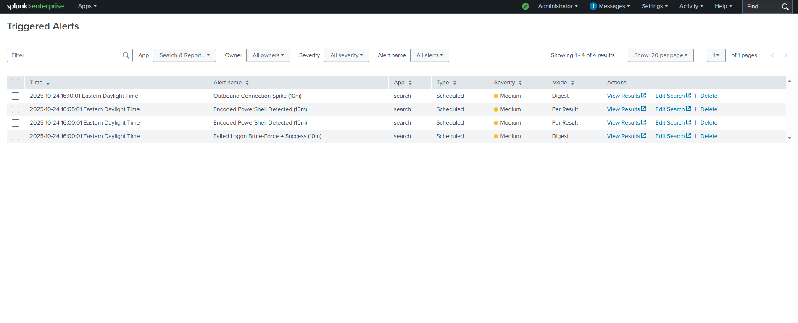
- Configuration export: [config/savedsearches.conf](./config/savedsearches.conf)

**Result:**  
Alerts now automatically detect failed logon correlation, encoded PowerShell commands, and outbound network spikes in near real time.


